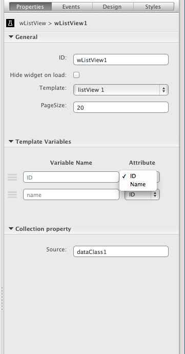
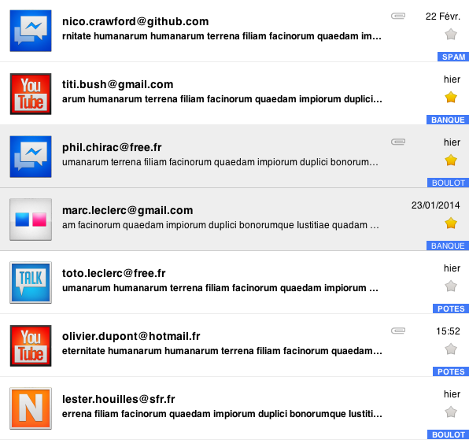

## wListView Widget for [Wakanda](http://wakanda.org)
This widget shows data from a datasource in a list view style. It has 3 customised templates that you can easily adapt and add new templates.

With a light implementation, this widget is great for mobiles and tablets, it has a "load more" implementation which automatically charges more data for you when the user gets closer to the end of the list.

wListView Tutorial
=================
The following subjects are covered in this tutorial:

* **The basics:** how to configure the widget using Wakanda Studio
* **Adding/editing templates** How to add your own template or edit an existing one
* **Advanced:** how to write your own template with images and optional elements

## 1. Studio Configuration

You can configure the following options for this widget:

### 1.1 General

* **Template**: the template to use to display the data (see below for more information on templates)
* **PageSize**: the number of items to fetch initially (and at the end of each scroll)

### 1.2 Template Variables

In this section, you map each attribute with a variable name found in the selected template to an attribute in your datasource. You may map the same attribute to several variable names.

### 1.3 Collection Property

The source property is the datasource that will supply data to your list. Each row in your datasource's collection, up to *pageSize*, will be rendered using the map that was previously set.

## 2. Adding/Editing templates

The templates are defined inside the `templates.js` file. By default, the widget has the following templates:

    {
        list: [
            {
                description: 'listView 1',
                template: '<li><strong>(ID = _({{ID}})</strong>name = {{name}}</li>',
            },
            {
                description: 'listView 2',
                template: '<li>{{ID}}</li>'
            },
            {
                description: 'listView 3',
                template: '<li>{{title}}</li>'
            }
        ],
        defaultData: {
            items: [
                { name: "Leon", ID: "190", logo: "/images/avatar1.png", title: 'title 1' },
                { name: "Marc", ID: "10", logo: "", title: 'title 2' },
                { name: "John", ID: "1", logo: "", title: 'This is John!' }
            ]
        }
    }

The list is an array of objects with two properties:

* **description**: name of the template that will appear in the **1.2**
* **template**: an html fragment that contains special **variables** that will be replaced by the contents of the attributes as set in the *template variables* property.

### 2.1 Adding a template

To add a new template to your widget, simply add a new entry to the list array.

**NOTE:** When modifying the `templates.js` file, you *must* **reload** your page.

### 2.1 Editing a template

A template is basically an HTML fragment with **special variables** put between curly braces (*{{var}}*) for each row in the datasource's collection, the wListView widget will render the HTML, replacing the variables with the contents of the row.

The template follows the [HandleBars][handlebars] template, which is a powerful JavaScript template system that's already used in many places, including EmberJS.

Variables are put between curly braces {{}}. You can use anything with a letter; however, you cannot use any special characters or spaces (which are reserved for advanced template management).

Template example:

    {
        description: 'listView 1',
        template: '<li><strong>(ID = _({{ID}})</strong>name = {{name}}</li>',
    }

This template is named "listView1" and has two variables: *ID* and *name*.

If you had a datasource with the following rows:

    {ID: 0, name: 'Mark'}, {ID:1, name: 'John'}

The data in the template would be rendered like this:

    <li><strong>(ID = _(0)</strong>name = Mark</li>
    <li><strong>(ID = _(1)</strong>name = John</li>

## 3. Advanced

The good thing about templates is that they are not limited to variables. What if you wanted:

* conditional elements ?
* to format your variables (eg. date, currency,...) ?

Well, the good news is that HTML templates allows to do that!

In the following example we will learn how to create more complex templates, like the one found in wEmailListApp:

This template could be used in an email app and has the following features:

* line can be selected depending on a variable (attribute) value
* line will display the *attachement* icon only if attachment variable is set to true
* line will use a variable as an  source tag
* data will be formatted and not displayed as-is, depending on today's date
* rows that have the favorite attribute set to true will have the "star" icon

As you can see, lots of things can be done with templates, and with very little code.

Here is the template:

    <li{{#if isRead}} class="read"{{/if}}>
        <date>{{date}}</date>
        {{#if attachment}}
            
        {{/if}}
        
        <h3>{{email}}</h3>
        <button class="star"></button>
        

            {{text}}
        

        {{tag}}
    </li>

While this sounds a little complicated, let's describe each line:

* The special variable `{{#if variable}}...{{/if}}` allows you to include text depending on a boolean value. In the above example, the *read* class will only be added to the line if the *isRead* variable of the row is set to true.
* The same conditional value is used for the *attachment* attribute.
* You may have noticed that the date format is variable: it actually depends on today's date. It will display *hier* (yesterday) if the date was yesterday, only the time if it is today, or the full date. To do that, we have simply
defined a hook using the `setHook` method:
    wListView = Widget.create('wListView', undefined, {
        init: function() {
            this.setHook('date', function(dateStr) { return 'the date is: ' + str; })
        }
        });
* The variable can be placed anywhere in the HTML, including in attribute values. In the above example, the *avatar* variable is used as a source for an image: ``

As you can see, it's quite simple to extend templates to create complex views.

[handlebars]: http://handlebarsjs.com/ "Visit HandleBars website"

### More Information
For more information on how to install a custom widget, refer to [Installing a Custom Widget](http://doc.wakanda.org/WakandaStudio0/help/Title/en/page3869.html#1027761).

For more information about Custom Widgets, refer to [Custom Widgets](http://doc.wakanda.org/Wakanda0.v5/help/Title/en/page3863.html "Custom Widgets") in the [Architecture of Wakanda Applications](http://doc.wakanda.org/Wakanda0.v5/help/Title/en/page3844.html "Architecture of Wakanda Applications") manual.
